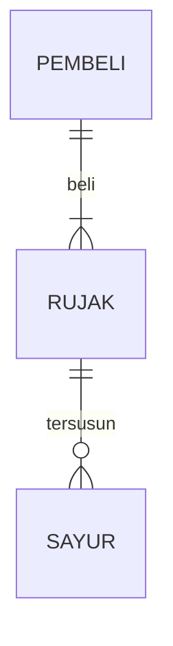

# Job-Interview.
## 1.1 Latar Belakang

Tujuan saya membuat game ini adalah agar kita mengetahui ada beberapa hewan yang proses perkembangan biologinya melibatkan perubahan penampilan dan/atau struktur setelah kelahiran atau penetasan yaitu metamorfosis,dikareanakan tidak semua hewan dalam masa pertumbuhannya tidak berubah bentuk dari ulat menjadi kupu-kupu,dari awalnya saya diskusi bersama teman teman lalu saya ada kepikiran untuk membuat game ini dari di ajarkan smp maupun sma di pelajaran biologi lalu saya ingin membuatnya ke dalam game 2d.

## 1.2. Deksripsi Teknologi Informasi

- Untuk Membuat programnya saya menggunakan aplikasi Visual Studio Code,
- Bagian Frontend saya menggunakan beberapa kombinasi seperti CSS, BOOTSTRAP, dan JAVASCRIPT

## 1.3. Branding

- Merk: A Small Example Of Metamorphosis
- Tagline: "Let's study the biological symptoms of metamorphosis"
- Campaign:  
- Target user:
    - Usia 5+
    - Seorang yang ingin mendapat gambaran dari gejala biologi metamorfosis
    - Seorang yang suka bermain game edukasi
    - Seorang yang ingin belajar tetapi lewat bermain game
- User experience theme:
    - Sederhana
    - sesuai dengan habitatnya
    - background dedaunan hutan seakan akan banyak ulat yang akan bermetamorfosis
   

## 2. User Story

bla | bla | bla | bla
---|---|---|---
bla | bla | bla | ⭐⭐⭐⭐⭐

## 3. Struktur Data

Cara membuat aneka macam bentuk grafik menggunakan mermaid.js bisa lihat di [https://mermaid.js.org/syntax/entityRelationshipDiagram.html](https://mermaid.js.org/syntax/entityRelationshipDiagram.html) 

## 4. Arsitektur Sistem

Masih pake mermaid.js juga bisa lihat flowchart di [https://mermaid.js.org/syntax/flowchart.html](https://mermaid.js.org/syntax/flowchart.html)

## 5. Teknologi, Library, dan Framework

No | Teknologi | Library | Framework
---|---|---|---
1 | HTML,CSS,Java Script(sementara baru ini mungkin kedepannya akan lebih banyak lagi) | eventlistener untuk melakukan gerakan ke atas dan ke samping | Bootstrap’s CSS and JS

## 6. Desain User Experience dan User Interface

Bisa load image 

## 7. Demonstrasi Video

Link youtube nya

## 8. Bagaimana mesin komputasi dan sistem operasi berperan dalam produk teknologi informasimu ?

Link youtube nya di detik jawaban ini

## 9. Bagaimana algoritma, struktur data, dan bahasa pemrograman berperan dalam produk teknologi informasimu ?

Link youtube nya di detik jawaban ini

## 10. Bagaimana metode pengembangan perangkat lunak / Software Development Life Cycle berperan dalam produk teknologi informasimu ?

Link youtube nya di detik jawaban ini

## 11. Bagaimana database / sistem basis data berperan dalam produk teknologi informasimu ?

Link youtube nya di detik jawaban ini
