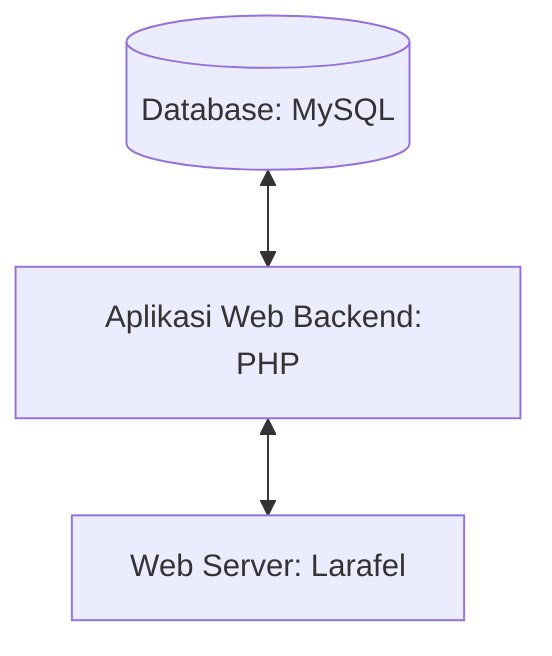

# Job-Interview.
## 1.1 Latar Belakang

Tujuan saya membuat game ini adalah agar kita mengetahui ada beberapa hewan yang proses perkembangan biologinya melibatkan perubahan penampilan dan/atau struktur setelah kelahiran atau penetasan yaitu metamorfosis,dikareanakan tidak semua hewan dalam masa pertumbuhannya tidak berubah bentuk dari ulat menjadi kupu-kupu,dari awalnya saya diskusi bersama teman teman lalu saya ada kepikiran untuk membuat game ini dari di ajarkan smp maupun sma di pelajaran biologi lalu saya ingin membuatnya ke dalam game 2d,Tujuan dari adanya game diantaranya adalah sebagai media hiburan, pendidikan, ataupun tujuan lainnya. Keberadaan game memiliki dampak yang besar, baik itu dampak positif yang ditimbulkan dengan adanya game, maupun dampak negatifnya.

## 1.2. Deksripsi Teknologi Informasi
- database akan menggunakan Mysqldatabase akan menggunakan Mysql,
- Untuk Membuat programnya saya menggunakan aplikasi Visual Studio Code,
- Untuk bahasa pemograman saya menggunakan Jvascript,Html,dan Css
- Untuk desain menggunakan figma
  

## 1.3. Branding

- Merk: A Small Example Of Metamorphosis
- Tagline: "Let's study the biological symptoms of metamorphosis"
- Campaign:  
- Target user:
    - Usia 5+
    - Seorang yang ingin mendapat gambaran dari gejala biologi metamorfosis
    - Seorang yang suka bermain game edukasi
    - Seorang yang ingin belajar tetapi lewat bermain game
- User experience theme:
    - Sederhana
    - sesuai dengan habitatnya
    - background dedaunan hutan seakan akan banyak ulat yang akan bermetamorfosis
    - inspirasi desain:
 
      
      

   

## 2. User Story
Sebagai | Saya ingin bisa | Sehingga | Prioritas
---|---|---|---
User | menenangkan pikiran | saya berpikir jernih | ⭐⭐⭐⭐⭐
User | menghilangkan penat | mood saya naik| ⭐⭐⭐⭐⭐⭐
User | membayangkan proses metamorfosis terjadi | agar pengetahuan saya bertambah | ⭐⭐⭐⭐⭐
User | melihat ending dari game ini | saya mengetahuinya | ⭐⭐⭐⭐
User | perkembangan char dari game ini| saya dapat melihat perkembangan karakter dari game ini|⭐⭐⭐⭐⭐
Admin| bisa mengupdate scoreboard | saya bisa melihat score saya sendiri|⭐⭐⭐⭐
Admin| bisa meriset score | saya bisa terus mengejar score orang lain | ⭐⭐⭐⭐⭐
Admin| ban cheater | game saya bersih tanpa ada kecurangan| ⭐⭐⭐⭐⭐⭐

## 3. Struktur Data

## 4. Arsitektur Sistem

## 5. Teknologi, Library, dan Framework

No | Teknologi | Library | Framework
---|---|---|---
1 | HTML,CSS,Java Script(sementara baru ini mungkin kedepannya akan lebih banyak lagi) | eventlistener untuk melakukan gerakan ke atas dan ke samping | Bootstrap’s CSS and JS

## 6. Desain User Experience dan User Interface

Bisa load image 
https://www.figma.com/file/FFk2LMaflklLfx33y3Bxor/Untitled?type=design&node-id=0-1&mode=design&t=pgyG18HW9IVVXTI9-0

## 7. Demonstrasi Video

Link youtube nya

## 8. Bagaimana mesin komputasi dan sistem operasi berperan dalam produk teknologi informasimu ?

Link youtube nya di detik jawaban ini

## 9. Bagaimana algoritma, struktur data, dan bahasa pemrograman berperan dalam produk teknologi informasimu ?

Link youtube nya di detik jawaban ini

## 10. Bagaimana metode pengembangan perangkat lunak / Software Development Life Cycle berperan dalam produk teknologi informasimu ?

Link youtube nya di detik jawaban ini

## 11. Bagaimana database / sistem basis data berperan dalam produk teknologi informasimu ?

Link youtube nya di detik jawaban ini
